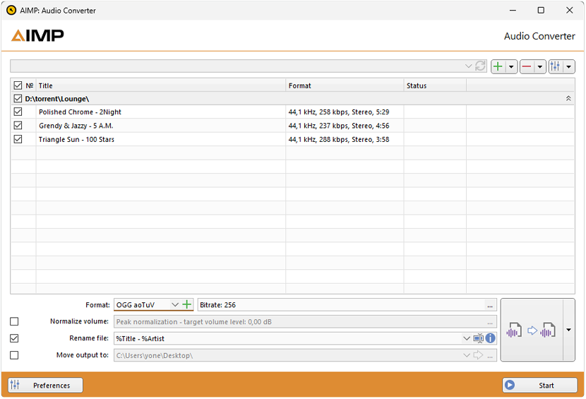

# OGG aoTuV music tracks converter for AIMP player.

Among Ogg Vorbis encoders, aoTuV is the leader in quality.   
Encoding speed compared to original aoTuV can be 100-200% faster.



According to testing results, Lancer is 2-10% faster, depending on the configuration and encoding parameters.   

### Installing converter.

**1.** Copy file "oggenc2.exe" to the AIMP folder "C:\Program Files\AIMP3\System\Encoders\".

**2.** Open and edit file "Encoders.xml" inside folder "Encoders". Before the last line of text `</encoders>`, paste the code below:   

````
```
 <encoder Name="OGG aoTuV" App="oggenc2.exe">

		<description>

			<inputformats type="autogen">
<autogen SampleRates="8000;11025;12000;16000;22050;24000;32000;44100;48000" SampleFormats="16;32" Channels="1;2;4;6" />
			</inputformats>

			<property name="Ext" value=".ogg" />
		</description>

		<presets>		
			<preset Name="Bitrate: 32"     cmdparams="-s %r -Q -q-2 --ignorelength - -o %output%" />
			<preset Name="Bitrate: 48"     cmdparams="-s %r -Q -q-1 --ignorelength - -o %output%" />
			<preset Name="Bitrate: 64"     cmdparams="-s %r -Q -q0 --ignorelength - -o %output%" />
			<preset Name="Bitrate: 80"     cmdparams="-s %r -Q -q1 --ignorelength - -o %output%" />
			<preset Name="Bitrate: 96"     cmdparams="-s %r -Q -q2 --ignorelength - -o %output%" />
			<preset Name="Bitrate: 112"     cmdparams="-s %r -Q -q3 --ignorelength - -o %output%" />
			<preset Name="Bitrate: 128"     cmdparams="-s %r -Q -q4 --ignorelength - -o %output%" />
			<preset Name="Bitrate: 160"     cmdparams="-s %r -Q -q5 --ignorelength - -o %output%" />
			<preset Name="Bitrate: 192"     cmdparams="-s %r -Q -q6 --ignorelength - -o %output%" />
			<preset Name="Bitrate: 224"     cmdparams="-s %r -Q -q7 --ignorelength - -o %output%" />
			<preset Name="Bitrate: 256"     cmdparams="-s %r -Q -q8 --ignorelength - -o %output%" />
			<preset Name="Bitrate: 320"     cmdparams="-s %r -Q -q9 --ignorelength - -o %output%" />
			<preset Name="Bitrate: 500"     cmdparams="-s %r -Q -q10 --ignorelength - -o %output%" />	
		</presets>

	</encoder>	
```
```` 

**3.** Save file. That`s All.   

### For use: Menu - Utilities - Audio Converter - in Settings - OGG aoTuV. 

. . . . . . . . . . . . . . . . . . . . . . . . . . . . . . . . . . . . . . . . . . . . . . . . . . . . . . .   

[OGG aoTuV](https://ao-yumi.github.io/aotuv_web/index.html)    
aoTuV stands for Aoyumi's Tuned Vorbis and it is a third-party development or tuning encode library for Ogg Vorbis.   

